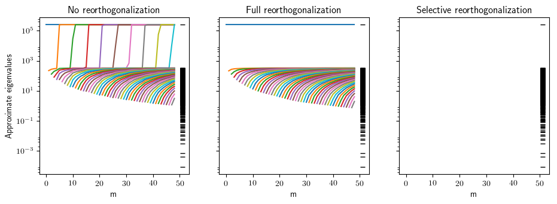

# lanczos-restart-strategies

#### Enables testing and applications of restarting strategies for Lanczos tridiagonalizations used in solving sequences of eigenvalue problems.

Author: Nicolas Venkovic

email: [venkovic@cerfacs.fr](mailto:venkovic@cerfacs.fr)

_TeX expressions rendered by [TeXify](https://github.com/apps/texify)._

### Dependencies:

 - *Python* (2.x >= 2.6)
 - *SciPy* (>= 0.11)
 - *NumPy* (>= 1.6)

### Files' content:

Files: _Lanczos_Ritz.py_.

Classes: `None`.

- _Lanczos_Ritz.py_ : 

  Signature : `sampler`(`nEL`=`500`,`smp_type`=`"mc"`, `model`=`"SExp"`, `sig2`=`1`, `mu`=`0`, `L`=`0.1`, `vsig2`=`None`,`delta2`=`1e-3`, `seed`=`123456789`, `verb`=`1`, `xa`=`0`, `xb`=`1`, `u_xb`=`None`, `du_xb`=`0`)

  Assembles sampled operators in a sequence $\{\mathbf{A}(\theta_t)\}_{t=1}^M$ for the stochastic system $\mathbf{A}(\theta)\mathbf{u}(\theta)=\mathbf{b}$ of a P0-FE discretization of the SDE $\partial_x[\kappa(x;\theta)\partial_xu(x;\theta)]=-f(x)$ for all $x\in(x_a, x_b)$ and $u(x_a)=0$. The stationary lognormal coefficient field $\kappa(x;\theta)$ is represented by a truncated Karhunen-Loève (KL) expansion later sampled either by Monte Carlo (MC) or by Markov chain Monte Carlo (MCMC).

  - `nEl` (`int`, `nEl`>`0`) : Number of elements.

  - `smp_type` (`string`, {`"mc"` , `"mcmc"`}) : Sampling strategy of the KL expansion.

  - `model` (`string`, {`"SExp"`, `"Exp"`}) : Covariance model.

    `"SExp"` : Square exponential model.

    `"Exp"` : Exponential model.

  - `sig2` (`float`, `sig2`>`0`) : Variance.

  - `mu` (`float`) : Mean.

  - `L` (`float`, `L`>`0`) : Correlation length.

  - `delta2` (`float`, `0`<`delta2`<`1`) : Tolerance for the relative error in variance of the truncated KL representation. Used to evaluate the number `nKL`<`nEL` of terms kept in the expansion.

  - `seed` (`int`, `seed`>=`0`) : RNG seed.

  - `verb` (`int`, {`0`,`1`, `2`}) : Verbose parameter.

    - `0` : No standard output, new KL expansion not saved.
    - `1` : No standard output, new KL expansion saved in file.
    - `2` : Basic standard output, new KL expansion saved in file.

  - `vsig2` (`float`, `vsig2`>`0`) : Variance of the random walk for the proposal of the MCMC sampler. If `None`, eventually set to `2.38**2/nKL`.

  - `xa`, `xb` (`float`, `xa`<`xb`) : Domain extent.

  - `u_xb`, `du_xb` (`float`) : $u(x_b)$ and $\partial_xu(x_b)$. `u_xb` must be `None` if `du_xb`!=`None`. `du_xb` must be `None` if `u_xb`!=`None`.


  Public methods : `compute_KL`(`self`), `draw_realization`(`self`), `do_assembly`(`self`), `get_kappa`(`self`), `get_median_A`(`self`).


### Usage:

Examples:

- _example01.py_ : Use of the `lanczos` class to investigate the effect of `reortho` on the evolution of approximate eigenvalues.

#### Example #1: example01_sampler.py

Draws and plots realizations of the lognormal coefficient field $\kappa(x;\theta)$ with an exponential covariance sampled by Monte Carlo, and by Markov chain Monte Carlo.  

```python
import sys; sys.path += ["../"]
from lanczos import lanczos_demmel, get_T, get_approx_eigvecs, get_eigvals
import numpy as np 
import scipy.sparse as sparse
import scipy.sparse.linalg

import pylab as pl 
pl.rcParams['text.usetex'] = True
params={'text.latex.preamble':[r'\usepackage{amssymb}',r'\usepackage{amsmath}']}

figures_path = '../figures/'


n = 1000
A = np.random.rand(n, n)
A = A.dot(A.T)

v = np.random.rand(n)
v /= np.linalg.norm(v)

m = 50

"""
V, alpha, beta = Lanczos(A, v, m)

n_eigvecs = 7
eigvals = get_eigvals(A, n_eigvecs)
err_bnd, iterated_err_bnd, approx_eigvals, global_err, local_err = [], [], [], [], []
for m_j in range(10, m+1):
  T = get_T(alpha[:m_j], beta[:m_j-1])
  Y, _approx_eigvals, _err_bnd, _iterated_err_bnd, _global_err, _local_err = get_approx_eigvecs(T, V[:,:m_j], A, beta[:m_j-1], n_eigvecs, eigvals=eigvals, output_format=1)
  approx_eigvals += [_approx_eigvals]
  err_bnd += [_err_bnd]
  iterated_err_bnd += [_iterated_err_bnd]
  global_err += [_global_err]
  local_err += [_local_err]
err_bnd, iterated_err_bnd = np.array(err_bnd), np.array(iterated_err_bnd)
global_err, local_err = np.array(global_err), np.array(local_err)

fig = pl.figure()
for i in range(n_eigvecs):
  pl.semilogy([_eigvals[i] for _eigvals in approx_eigvals])
  pl.xlabel("m")
  pl.ylabel(r"$\theta_k^{(m)}$")
pl.show()
"""

#n_eigvecs = 7
eigvals = np.linalg.eigvalsh(A)[-1::-1]
data = lanczos(A, m, eigvals=eigvals)
data_full = lanczos(A, m, reortho="full", eigvals=eigvals)

approx_eigvals, approx_eigvals_full = [], []
mm = len(data["approx_eigvals"])
mj = len(data["approx_eigvals"][-1])
for i in range(mj):
  approx_eigvals += [i*[None]+[d[i] for d in data["approx_eigvals"][i:]]]
  approx_eigvals_full += [i*[None]+[d[i] for d in data_full["approx_eigvals"][i:]]]
approx_eigvals = np.array(approx_eigvals)
approx_eigvals_full = np.array(approx_eigvals_full)

fig, ax = pl.subplots(1, 3, figsize=(11,3.4), sharey="row")

ax[0].set_title("No reorthogonalization")
for i in range(mj):
  ax[0].semilogy(approx_eigvals[i,:])
ax[0].semilogy(eigvals.shape[0]*[mj+1], eigvals, "k_", lw=0)

ax[1].set_title("Full reorthogonalization")
for i in range(mj):
  ax[1].semilogy(approx_eigvals_full[i,:])
ax[1].semilogy(eigvals.shape[0]*[mj+1], eigvals, "k_", lw=0)

ax[2].set_title("Selective reorthogonalization")
for i in range(mj):
  ax[2].semilogy(approx_eigvals_full[i,:], "w")
ax[2].semilogy(eigvals.shape[0]*[mj+1], eigvals, "k_", lw=0)

ax[1].set_ylim(ax[0].get_ylim()); ax[2].set_ylim(ax[0].get_ylim())

ax[0].set_ylabel("Approximate eigenvalues")
ax[0].set_xlabel("m"); ax[1].set_xlabel("m"); ax[2].set_xlabel("m")
pl.savefig(figures_path+"example01.png", bbox_inches='tight')
```

Output :


