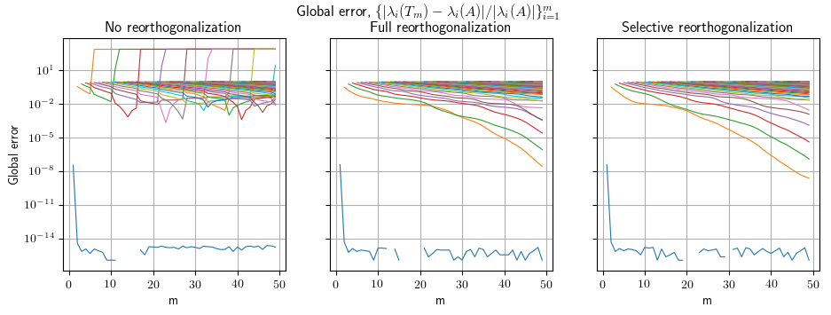

# lanczos-restart-strategies

#### Enables testing and applications of restarting strategies for Lanczos tridiagonalizations used in solving sequences of eigenvalue problems.

Author: Nicolas Venkovic

email: [venkovic@cerfacs.fr](mailto:venkovic@cerfacs.fr)

_TeX expressions rendered by [TeXify](https://github.com/apps/texify)._

### Dependencies:

 - *Python* (2.x >= 2.6)
 - *SciPy* (>= 0.11)
 - *NumPy* (>= 1.6)

### Files' content:

Files: _lanczos.py_.

Classes: `lanczos`.

- _lanczos.py_ : 

  Signature : `sampler`(`nEL`=`500`,`smp_type`=`"mc"`, `model`=`"SExp"`, `sig2`=`1`, `mu`=`0`, `L`=`0.1`, `vsig2`=`None`,`delta2`=`1e-3`, `seed`=`123456789`, `verb`=`1`, `xa`=`0`, `xb`=`1`, `u_xb`=`None`, `du_xb`=`0`)

  Assembles sampled operators in a sequence $\{\mathbf{A}(\theta_t)\}_{t=1}^M$ for the stochastic system $\mathbf{A}(\theta)\mathbf{u}(\theta)=\mathbf{b}$ of a P0-FE discretization of the SDE $\partial_x[\kappa(x;\theta)\partial_xu(x;\theta)]=-f(x)$ for all $x\in(x_a, x_b)$ and $u(x_a)=0$. The stationary lognormal coefficient field $\kappa(x;\theta)$ is represented by a truncated Karhunen-Loève (KL) expansion later sampled either by Monte Carlo (MC) or by Markov chain Monte Carlo (MCMC).

  - `nEl` (`int`, `nEl`>`0`) : Number of elements.

  - `smp_type` (`string`, {`"mc"` , `"mcmc"`}) : Sampling strategy of the KL expansion.

  - `model` (`string`, {`"SExp"`, `"Exp"`}) : Covariance model.

    `"SExp"` : Square exponential model.

    `"Exp"` : Exponential model.

  - `sig2` (`float`, `sig2`>`0`) : Variance.

  - `verb` (`int`, {`0`,`1`, `2`}) : Verbose parameter.

    - `0` : No standard output, new KL expansion not saved.
    - `1` : No standard output, new KL expansion saved in file.
    - `2` : Basic standard output, new KL expansion saved in file.

  - `vsig2` (`float`, `vsig2`>`0`) : Variance of the random walk for the proposal of the MCMC sampler. If `None`, eventually set to `2.38**2/nKL`.


  Public methods : `compute_KL`(`self`), `draw_realization`(`self`).


### Usage:

Examples:

- _example01_lanczos.py_ : Use of the `lanczos` class to investigate the effect of full and selective reorthogonalization on the evolution of approximate eigenvalues.

#### Example #1: example01_lanczos.py

Investigates the effect of full and selective reorthogonalization on the evolution of approximate eigenvalues.

```python
import sys; sys.path += ["../"]
from lanczos import lanczos
import numpy as np 
import scipy.sparse as sparse
import scipy.sparse.linalg
import time

import pylab as pl 
pl.rcParams['text.usetex'] = True
params={'text.latex.preamble':[r'\usepackage{amssymb}',r'\usepackage{amsmath}']}

figures_path = '../figures/'

n = 1000
A = np.random.rand(n, n)
A = A.dot(A.T)

m = 50
npairs = 10

eigvals = np.linalg.eigvalsh(A)[-1::-1]
t0 = time.time()
data = lanczos(A, npairs, m=m, eigvals=eigvals)
print("No reorthogonalization : %g" %(time.time()-t0)); t0 = time.time()
data_full = lanczos(A, npairs, m=m, reortho="full", eigvals=eigvals)
print("Full reorthogonalization : %g" %(time.time()-t0)); t0 = time.time()
data_selective = lanczos(A, npairs, m=m, reortho="selective", eigvals=eigvals)
print("Selective reorthogonalization : %g" %(time.time()-t0)); t0 = time.time()

approx_eigvals, approx_eigvals_full, approx_eigvals_selective = [], [], []
iterated_error_bound, iterated_error_bound_full, iterated_error_bound_selective = [], [], []
mm = len(data["approx_eigvals"])
mj = len(data["approx_eigvals"][-1])
for i in range(mj):
  approx_eigvals += [i*[None]+[d[i] for d in data["approx_eigvals"][i:]]]
  approx_eigvals_full += [i*[None]+[d[i] for d in data_full["approx_eigvals"][i:]]]
  approx_eigvals_selective += [i*[None]+[d[i] for d in data_selective["approx_eigvals"][i:]]]

  iterated_error_bound += [i*[None]+[d[i] for d in data["iterated_error_bound"][i:]]]
  iterated_error_bound_full += [i*[None]+[d[i] for d in data_full["iterated_error_bound"][i:]]]
  iterated_error_bound_selective += [i*[None]+[d[i] for d in data_selective["iterated_error_bound"][i:]]]

approx_eigvals = np.array(approx_eigvals)
approx_eigvals_full = np.array(approx_eigvals_full)
approx_eigvals_selective = np.array(approx_eigvals_selective)

iterated_error_bound = np.array(iterated_error_bound)
iterated_error_bound_full = np.array(iterated_error_bound_full)
iterated_error_bound_selective = np.array(iterated_error_bound_selective)

fig, ax = pl.subplots(1, 3, figsize=(11,3.4), sharey="row")
lw = .5
ax[0].set_title("No reorthogonalization")
for i in range(mj):
  ax[0].semilogy(range(1,m), approx_eigvals[i,:], "+")
for i in range(mj):
  ax[0].semilogy(range(1,m), approx_eigvals[i,:], "-", lw=lw)
ax[0].semilogy(eigvals.shape[0]*[mj+3], eigvals, "k_", lw=0)

ax[1].set_title("Full reorthogonalization")
for i in range(mj):
  ax[1].semilogy(range(1,m), approx_eigvals_full[i,:], "+")
for i in range(mj):
  ax[1].semilogy(range(1,m), approx_eigvals_full[i,:], "-", lw=lw)
ax[1].semilogy(eigvals.shape[0]*[mj+3], eigvals, "k_", lw=0)

ax[2].set_title("Selective reorthogonalization")
for i in range(mj):
  ax[2].semilogy(range(1,m), approx_eigvals_selective[i,:], "+")
for i in range(mj):
  ax[2].semilogy(range(1,m), approx_eigvals_selective[i,:], "-",  lw=lw)
for j in range(3):
  ax[j].grid()
ax[2].semilogy(eigvals.shape[0]*[mj+3], eigvals, "k_", lw=0)
ax[1].set_ylim(ax[0].get_ylim()); ax[2].set_ylim(ax[0].get_ylim())
ax[0].set_ylabel("Approximate eigenvalues")
fig.suptitle(r"$\{\lambda_i(T_m)\}_{i=1}^m$")
ax[0].set_xlabel("m"); ax[1].set_xlabel("m"); ax[2].set_xlabel("m")
pl.savefig(figures_path+"example01_lanczos_a.png", bbox_inches='tight')
#pl.show()

fig, ax = pl.subplots(1, 3, figsize=(11,3.4), sharey="row")
lw = .8
ax[0].set_title("No reorthogonalization")
for i in range(mj):
  ind = (iterated_error_bound[i,:]==None).sum()
  ax[0].semilogy(range(1,m), np.concatenate((iterated_error_bound[i,:ind],iterated_error_bound[i,ind:]/approx_eigvals[i,ind:])), "-", lw=lw)
ax[1].set_title("Full reorthogonalization")
for i in range(mj):
  ind = (iterated_error_bound_full[i,:]==None).sum()
  ax[1].semilogy(range(1,m), np.concatenate((iterated_error_bound_full[i,:ind],iterated_error_bound_full[i,ind:]/approx_eigvals_full[i,ind:])), "-", lw=lw)
ax[2].set_title("Selective reorthogonalization")
for i in range(mj):
  ind = (iterated_error_bound_selective[i,:]==None).sum()
  ax[2].semilogy(range(1,m), np.concatenate((iterated_error_bound_selective[i,:ind],iterated_error_bound_selective[i,ind:]/approx_eigvals_selective[i,ind:])), "-", lw=lw)
ax[1].set_ylim(ax[0].get_ylim()); ax[2].set_ylim(ax[0].get_ylim())
ax[0].set_ylim(1e-16,1e2)
ax[0].set_ylabel("Iterated relative error bound")
fig.suptitle(r"$\{|\beta_mS_{mi}/\lambda_i(T_m)|\}_{i=1}^m$")
for j in range(3):
  ax[j].set_xlabel("m")
  ax[j].grid()
pl.savefig(figures_path+"example01_lanczos_b.png", bbox_inches='tight')
#pl.show()

fig, ax = pl.subplots(1, 3, figsize=(11,3.4), sharey="row")
lw = .8
ax[0].set_title("No reorthogonalization")
for i in range(mj):
  ind = (approx_eigvals[i,:]==None).sum()
  ax[0].semilogy(range(1,m), np.concatenate((approx_eigvals[i,:ind],np.abs((approx_eigvals[i,ind:]-eigvals[i])/eigvals[i]))), "-", lw=lw)
ax[1].set_title("Full reorthogonalization")
for i in range(mj):
  ind = (approx_eigvals_full[i,:]==None).sum()
  ax[1].semilogy(range(1,m), np.concatenate((approx_eigvals_full[i,:ind],np.abs((approx_eigvals_full[i,ind:]-eigvals[i])/eigvals[i]))), "-", lw=lw)
ax[2].set_title("Selective reorthogonalization")
for i in range(mj):
  ind = (approx_eigvals_selective[i,:]==None).sum()
  ax[2].semilogy(range(1,m), np.concatenate((approx_eigvals_selective[i,:ind],np.abs((approx_eigvals_selective[i,ind:]-eigvals[i])/eigvals[i]))), "-", lw=lw)
ax[0].set_ylabel("Global error")
fig.suptitle("Global error, "+r"$\{|\lambda_i(T_m)-\lambda_i(A)|/|\lambda_i(A)|\}_{i=1}^m$")
for j in range(3):
  ax[j].set_xlabel("m")
  ax[j].grid()
pl.savefig(figures_path+"example01_lanczos_c.png", bbox_inches='tight')
#pl.show()

# TO DO:
# Q1:    HOW DO YOU PICK m for a given n_eigvecs?
#        You can not know this, see p. 239-240 of Dongara et al.'s book.
# T2:    Implement restart strategies.
#        Explicit vs implicit, see p. 239-240 of Dongara et al.'s book
```

Output :


