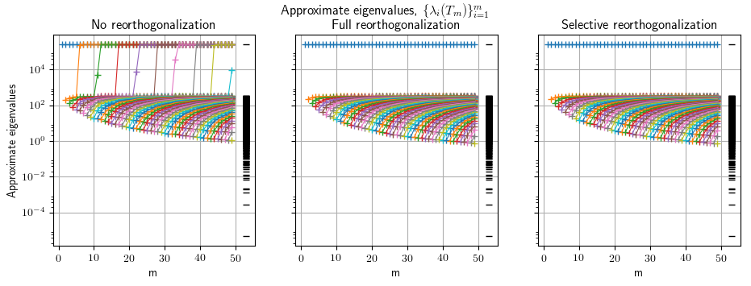
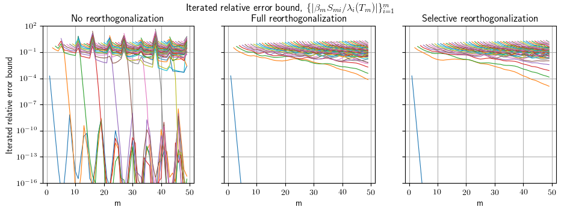

# lanczos-restart-strategies

#### Enables testing and applications of restarting strategies for Lanczos tridiagonalizations used in solving sequences of eigenvalue problems.

Author: Nicolas Venkovic

email: [venkovic@cerfacs.fr](mailto:venkovic@cerfacs.fr)

_TeX expressions rendered by [TeXify](https://github.com/apps/texify)._

### Dependencies:

 - *Python* (2.x >= 2.6)
 - *SciPy* (>= 0.11)
 - *NumPy* (>= 1.6)

### Files' content:

Files: _lanczos.py_.

Classes: `lanczos`.

- _lanczos.py_ : 

  Signature : `lanczos`(`m`)


  Public methods : `method`(`self`).


### Usage:

Examples:

- _example01_lanczos.py_ : Use of the `lanczos` class to investigate the effect of full and selective reorthogonalization on the evolution of approximate eigenvalues.

#### Example #1: example01_lanczos.py

Investigates the effect of full and selective reorthogonalization on the evolution of approximate eigenvalues.

```python
import sys; sys.path += ["../"]
from lanczos import lanczos
import numpy as np 
import time
from example01_lanczos_plot import *

n = 1000
A = np.random.rand(n, n)
A = A.dot(A.T)

m = 50
npairs = 10

eigvals = np.linalg.eigvalsh(A)[-1::-1]
t0 = time.time()
data = lanczos(A, npairs, m=m, eigvals=eigvals)
print("No reorthogonalization : %g" %(time.time()-t0)); t0 = time.time()
data_full = lanczos(A, npairs, m=m, reortho="full", eigvals=eigvals)
print("Full reorthogonalization : %g" %(time.time()-t0)); t0 = time.time()
data_selective = lanczos(A, npairs, m=m, reortho="selective", eigvals=eigvals)
print("Selective reorthogonalization : %g" %(time.time()-t0)); t0 = time.time()

approx_eigvals, approx_eigvals_full, approx_eigvals_selective = [], [], []
iterated_error_bound, iterated_error_bound_full, iterated_error_bound_selective = [], [], []
for i in range(m):
  approx_eigvals += [i*[None]+[d[i] for d in data["approx_eigvals"][i:]]]
  approx_eigvals_full += [i*[None]+[d[i] for d in data_full["approx_eigvals"][i:]]]
  approx_eigvals_selective += [i*[None]+[d[i] for d in data_selective["approx_eigvals"][i:]]]

  iterated_error_bound += [i*[None]+[d[i] for d in data["iterated_error_bound"][i:]]]
  iterated_error_bound_full += [i*[None]+[d[i] for d in data_full["iterated_error_bound"][i:]]]
  iterated_error_bound_selective += [i*[None]+[d[i] for d in data_selective["iterated_error_bound"][i:]]]

approx_eigvals = np.array(approx_eigvals)
approx_eigvals_full = np.array(approx_eigvals_full)
approx_eigvals_selective = np.array(approx_eigvals_selective)

iterated_error_bound = np.array(iterated_error_bound)
iterated_error_bound_full = np.array(iterated_error_bound_full)
iterated_error_bound_selective = np.array(iterated_error_bound_selective)

plot(m, eigvals, approx_eigvals, approx_eigvals_full, approx_eigvals_selective, 
     iterated_error_bound, iterated_error_bound_full, iterated_error_bound_selective) 
```

Output :






Observations :

Ghost (repeating) eigenvalues appear when no reorthogonalization is applied.

Memory requirements increase with m. Restart becomes necessary. 